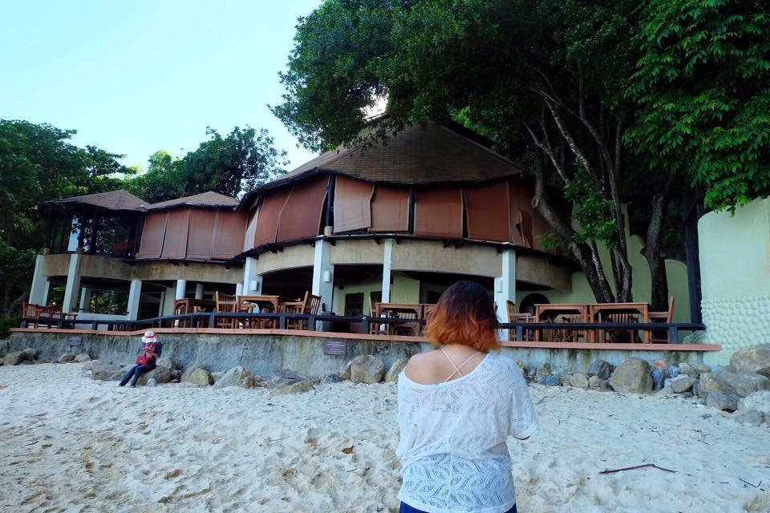
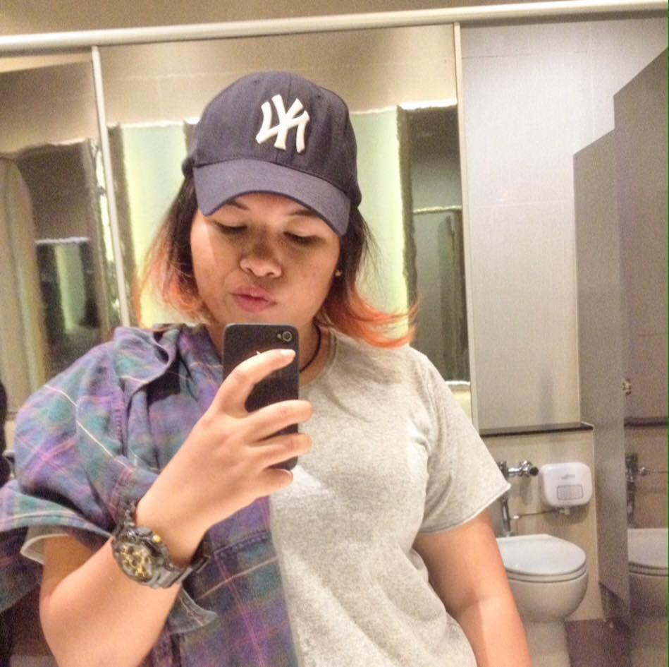
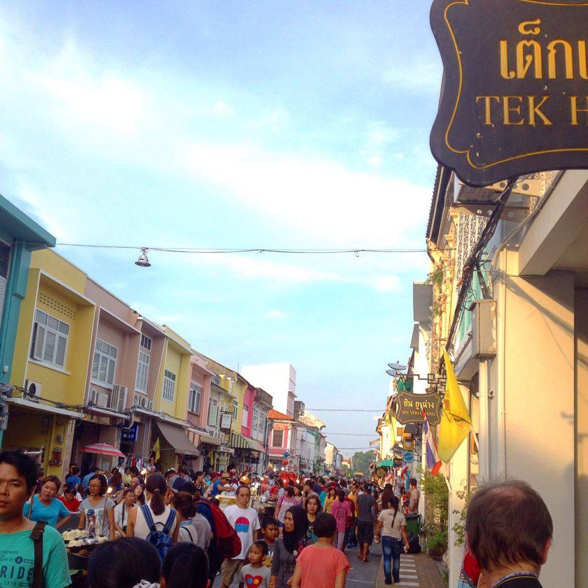
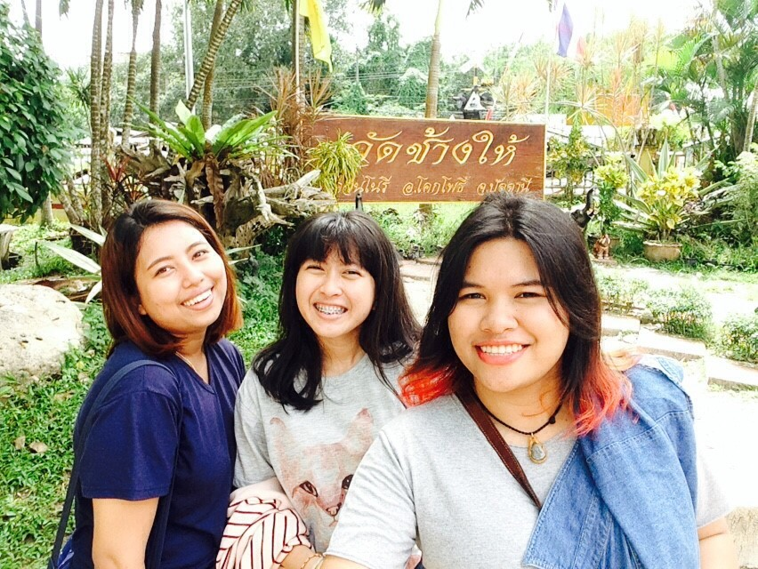

<html>
<title>W3.CSS Template</title>
<meta charset="UTF-8">
<meta name="viewport" content="width=device-width, initial-scale=1">
<link rel="stylesheet" href="https://www.w3schools.com/w3css/4/w3.css">
<link rel='stylesheet' href='https://fonts.googleapis.com/css?family=Roboto'>
<link rel="stylesheet" href="https://cdnjs.cloudflare.com/ajax/libs/font-awesome/4.7.0/css/font-awesome.min.css">

<body class="w3-red">

<!-- Page Container -->

  <!-- The Grid -->
  

  
    <!-- Left Column -->
    

    
      

        

          
          

            <h2>Tima</h2>
          

        

        

          
<i class="fa fa-home fa-fw w3-margin-right w3-large w3-text-teal"></i>Songkhla,Thailand

          
<i class="fa fa-envelope fa-fw w3-margin-right w3-large w3-text-teal"></i>thitima501@gmail.com

          
<i class="fa fa-phone fa-fw w3-margin-right w3-large w3-text-teal"></i>0808912545

          

          
<b><i class="fa fa-asterisk fa-fw w3-margin-right w3-text-teal"></i>Skills</b>

          
Adobe Photoshop

          

            
50%

          

          
Photography

          

            

              
80%

            

          

          
Violin

          

            
75%

          

          
Media

          

            
50%

          

           

          
<b><i class="fa fa-globe fa-fw w3-margin-right w3-text-teal"></i>Languages</b>

          
Thai

          

            

          

          
English

          

            

          

                   
           
          

       
      

       
<a href="https://www.facebook.com/timargolf">Facebook</a>

       
<a href="https://twitter.com/timaaaar">Twitter</a>

       
<a href="https://www.instagram.com/timaaaar/">Instagram</a>

        

      
 
    <!-- End Left Column -->

    <!-- Right Column -->
    

    
      

        <h2 class="w3-text-grey w3-padding-16"><i class="fa fa-flag fa-fw w3-margin-right w3-xxlarge w3-text-teal"></i>Education</h2>
        

          <h5 class="w3-opacity"><b></b></h5>
          <h6 class="w3-text-teal"><i class="fa fa-calendar fa-fw w3-margin-right"></i>2015- Current</h6>
          
Prince of Songkla University 
          Faculty Of Management Science 
		      Information System.
          

          

        

        

          <h5 class="w3-opacity"><b>Hatyairatprachasun School</b></h5>
          <h6 class="w3-text-teal"><i class="fa fa-calendar fa-fw w3-margin-right"></i>2008-2014</h6>
          
 lower secondary school- Mini English Program 
	            upper secondary school- Science-Math Program

          

        

      

        <h2 class="w3-text-black w3-padding-16"><i class="fa fa-star fa-fw w3-margin-right w3-xxlarge w3-text-teal"></i>Call me Golf</h2>
        

          <h5 class="w3-opacity"><b>Yesterday was yesterday, focus on today.</b></h5>
          <h6 class="w3-text-teal"><i class="fa fa-heart fa-fw w3-margin-right"></i>Yesterday was yesterday, focus on today.</h6>
          
          

        

   

  <!-- End Right Column -->
    

    <!-- Photo Grid -->
      

       

        
        
      

         

    
    
           

         

    
    
             

           

           <h2 class="w3-text-black w3-padding-16">
          <i class="fa fa-plane fa-fw w3-margin-right w3-xxlarge w3-text-teal"></i>Like to travel</h2>
        

        
          

          

          
          

        

          
          

        <!-- End Page Content -->
  <!-- End Grid -->
  

  
  <!-- End Page Container -->

<footer class="w3-container w3-teal w3-center w3-margin-top">
  
I hate school but i have goals.

 
</footer>
